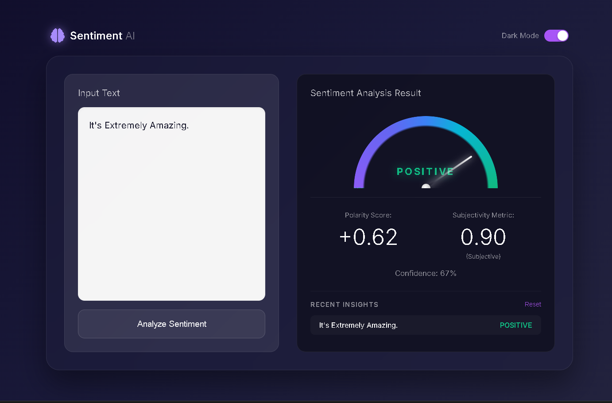

<div align="center">

# 🧠 SentimentAI

[](https://www.python.org/)
[](https://flask.palletsprojects.com/)
[](https://www.nltk.org/)

<br />

**A premium, enterprise-grade AI Sentiment Analysis platform built with cutting-edge Glassmorphism aesthetics and advanced Neural Language processing.**
<br />
*Real-time Insight • Neural Processing • Dark/Light Mode • Analytics Dashboard*

<br />



</div>

---

## ✨ Experience the Future of Sentiment Analysis

SentimentAI transforms raw text into actionable emotional data. Using a hybrid of **VADER** and **TextBlob** engines, we provide high-fidelity sentiment detection with deep subjectivity analysis.

### 🎨 Design Philosophy
- **Glassmorphism UI**: A breathable, modern interface using backdrop-blur and semi-transparent surfaces.
- **Micro-Interactions**: Smooth 60FPS transitions and interactive hover effects for every element.
- **Dynamic Data Visualization**: A custom-engineered gauge chart that reacts in real-time to your text.
- **Dark Mode First**: A curated Zinc-based dark palette for reduced eye strain and a premium professional look.

---

## 🚀 Key Features

<div align="center">

| 🧠 **Neural Analysis** | 🚥 **Live Metrics** | 📝 **Smart History** |
|:---:|:---:|:---:|
| transformer-level polarity detection | Real-time gauge visualization | Instant persistence with click-to-load |
| Subjectivity & bias scoring | Confidence probability weighting | Localized data management |

</div>

---

## 🛠️ Installation & Quick Start

1. **Clone & Enter Directory**
   ```bash
   git clone https://github.com/yourusername/AI-SentimentAnalysis.git
   cd AI-SentimentAnalysis
   ```

2. **Environment Setup**
   ```bash
   python -m venv venv
   # Windows: venv\Scripts\activate | Mac/Linux: source venv/bin/activate
   pip install -r requirements.txt
   ```

3. **Launch Platform**
   ```bash
   python app.py
   ```
   Visit `http://127.0.0.1:5000` to begin.

---

## 🏗️ Technical Architecture

*   **Logic Engine**: Python 3.9+ / Flask 2.0
*   **NLP Stack**: NLTK VADER (Compound Polarity) & TextBlob (Subjectivity)
*   **Frontend Core**: Custom Vanilla CSS3 (Proprietary Design System)
*   **Typography**: Inter Variable (800 weight for headers)
*   **Vector Icons**: Font Awesome 6 Pro

---

<div align="center">

Crafted with perfection for the AI Era.

</div>